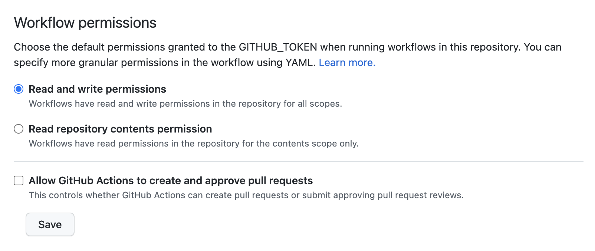

FAQs
====

.. note:: This page is still under construction. More FAQs will be added shortly!

Permissions errors in GitHub Actions
------------------------------------

If you try to build a |showyourwork| article from a repository fork
on GitHub Actions, you may run into the following error when the action
attempts to push the results to the ``-pdf`` branch:

.. code-block:: text

    Uploading output
    /tmp/tmp.KORuhtnUA7
    Switched to a new branch 'main-pdf'
    [main-pdf (root-commit) 224ecfd] force-push article output
    2 files changed, 0 insertions(+), 0 deletions(-)
    create mode 100644 arxiv.tar.gz
    create mode 100644
    remote: Permission to $USER/$REPO.git denied to github-actions[bot].
    fatal: unable to access 'https://github.com/$USER/$REPO/': The requested URL returned error: 403

This happens because the default GitHub Actions permissions for the ``GITHUB_TOKEN``
secret are set to ``restricted`` for repository forks. To get the build to work,
go to

.. raw:: html

    <pre>
    https://github.com/$USER/$REPO/settings/actions
    </pre>

and change the permissions to ``permissive``:

Debugging remote builds
-----------------------

Set ``CI=true`` environment variable to mimic the behavior on GitHub Actions locally.
More information on this soon.

Installing LaTeX
----------------

To install TeX for access in (say) Python scripts (e.g., for rendering LaTeX expressions
with ``matplotlib``), see 
`here <https://github.com/showyourwork/showyourwork/blob/f5a9332cb4b1d134bb2103fae2e2853da04fe501/showyourwork-action/src/tex.js>`__.
More information on this soon.

Using LaTeX Workshop in VSCode
------------------------------
If you edit and build your articles in VSCode, you need to specify some settings so that VSCode knows to use |showyourwork| to build your document.
You can do this by creating (or editing) a workspace-specific settings file, ``.vscode/settings.json``, in the root directory of your repo.
At minimum, you should add the following lines:

.. code-block:: json

    {
        "latex-workshop.latex.external.build.command": "showyourwork",
        "latex-workshop.latex.external.build.args": [],
        "latex-workshop.latex.outDir": "%WORKSPACE_FOLDER%",
        "latex-workshop.view.pdf.viewer": "tab",
    }

This enables you to build the document using ``LaTeX Workshop: Build LaTeX project`` in the command palette.
Note that the final line tells LaTeX Workshop to open your article pdf in a VSCode tab.
Feel free to change ``tab`` to ``browser`` if you would rather LaTeX Workshop open your article in a browser tab.

If you also want to use LaTeX Workshop's AutoBuild on save (or on file change), you can add the following lines to the settings file

.. code-block:: json

    {
        "latex-workshop.latex.recipe.default": "showyourwork",
        "latex-workshop.latex.recipes": [
            {
                "name": "showyourwork",
                "tools": [
                    "showyourwork"
                ]
            }
        ],
        "latex-workshop.latex.tools": [
            {
                "name": "showyourwork",
                "command": "showyourwork",
                "args": [],
                "env": {}
            },
        ],
    }

Note that there should only be one set of outer braces.
In other words, remove the final outer brace in the first block above and the first outer brace in the second block above.