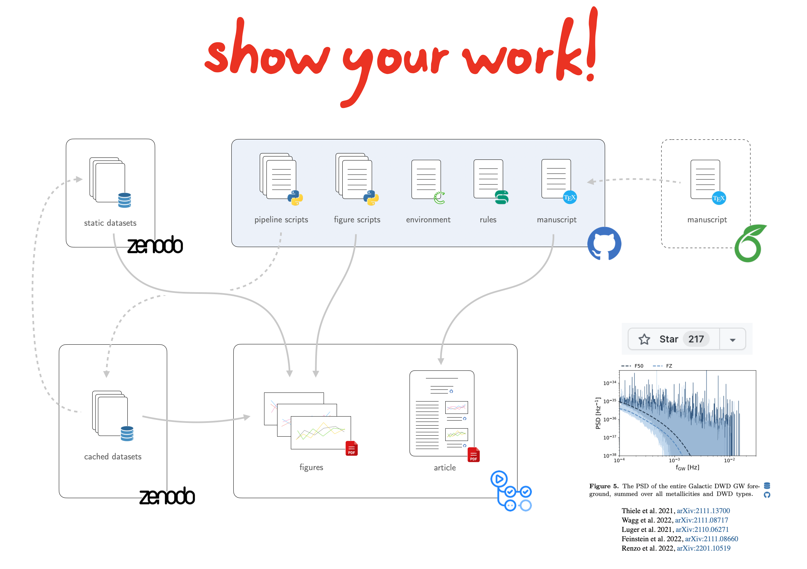

Introduction
============

The |showyourwork| workflow is intended to help authors publish open source,
replicable, and reproducible scientific articles. It ensures that the article
PDF is always in sync with all of the scripts, code, and data used to generate it. It does this
automatically—and seamlessly—with the help of the `Snakemake workflow management system <https://snakemake.readthedocs.io>`_,
the `tectonic typesetting engine <https://tectonic-typesetting.github.io>`_, and
`Github Actions CI <https://github.com/features/actions>`_.

.. raw:: html

    

        
The showyourwork philosophy

        
Scientific papers should exist as GitHub repositories comprised of
        LaTeX files, figure scripts, rules to generate and/or access datasets, a platform/environment specification,
        and nothing else.
        Anyone should be able to re-generate the article PDF from scratch at
        the click of a button.
        

    

Within the |showyourwork| workflow, scientific articles exist as GitHub repositories
with a :doc:`specific layout <layout>`. Whenever new commits are pushed to the remote
repository, a GitHub Action is triggered that automatically builds the article from the
input figure scripts, manuscript files, datasets, and
`conda environment file <https://conda.io/projects/conda/en/latest/user-guide/tasks/manage-environments.html>`_,
following the instructions specified in the `Snakefile <https://snakemake.readthedocs.io/en/stable/snakefiles/rules.html>`_:

The article PDF (along with a tarball containing all of the output) is then pushed to a special branch
(``main-pdf`` by default) on the repository. This article is decorated with badges linking to the exact
versions of the files on GitHub used to generate it.

Thanks to the magic of Snakemake, |showyourwork| is both lightweight—it should work out-of-the-box for most users—and highly
customizable. It also uses intelligent caching to never re-run things it doesn't have to (like figure scripts that haven't changed),
even when running on the cloud.

To get started with |showyourwork|, check out the :doc:`quickstart tutorial <quickstart>`.
You should also read about
the :doc:`showyourwork GitHub action <action>`, :doc:`LaTeX instructions <latex>`,
how to :doc:`build your article locally <cli>`,
and how to :doc:`customize your workflow <custom>`.

You should also spend some time browsing through the :doc:`FAQs page <faqs>`. Since |showyourwork|
is itself a work in progress, new features are still being added frequently. If you spot a bug,
have a question, or would like |showyourwork| to do something it doesn't currently support,
please feel free to raise a `GitHub issue <https://github.com/showyourwork/showyourwork/issues>`_.