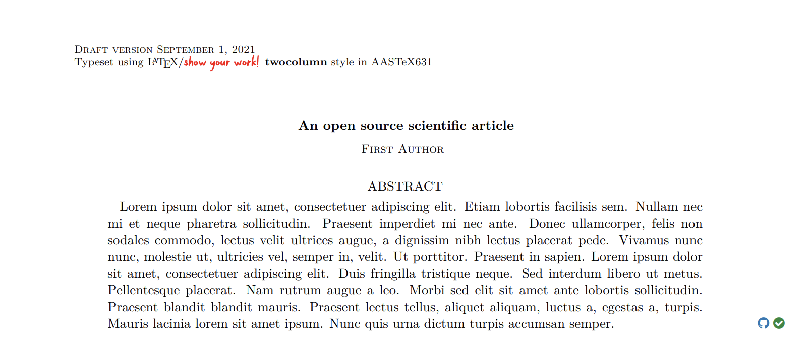

LaTeX stuff
===========

This page describes how |showyourwork| parses your LaTeX manuscript (by default,
the file ``src/ms.tex``) and uses it to build your article PDF. While you can
do just about anything you'd regularly do when writing in LaTeX, there are a 
few rules and details you should be aware of controlling the generation of figures
and the inclusion of clickable margin icons, which we discuss in detail below.

Overview
--------

By default, the LaTeX manuscript that gets compiled into your paper PDF looks
something like this:

.. code-block:: TeX

    % Define document class
    \documentclass[twocolumn]{aastex631}

    % Import showyourwork magic
    \usepackage{showyourwork}

    % Begin!
    \begin{document}

    % Title
    \title{An open source scientific article}

    % Author list
    \author{First Author}

    % Abstract with filler text
    \begin{abstract}
        Lorem ipsum...
    \end{abstract}

    % Main body with filler text
    \section{Introduction}
    Lorem ipsum...

    \end{document}

When you run |showyourwork|, the workflow generates a PDF that looks something like
this:

When you execute your workflow, |showyourwork| dynamically embellishes the
``showyourwork.sty`` file with all of the metadata needed to annotate the PDF
with the custom margin icons linking to the repository and the scripts that
generated the invididual figures.

While most users don't have to worry about how any of this works, it's important to
keep in mind that this dynamically-generated style sheet redefines certain LaTeX commands under
the hood, such as the ``abstract`` and ``figure`` environments and the
``includegraphics`` command. For instance, in order to include the
margin icons next to the abstract, |showyourwork| simply patches the ``abstract``
command to include a ``marginnote``. If you try to compile your PDF with a standard
``TeX`` compiler (such as ``pdflatex``), things should work just fine (as long as
the figures have all been previously generated), but you won't get any of the
annotations mentioned above.

The |showyourwork| style sheet also defines a few useful commands, the most
important of which is the ``script`` command for specifying figure scripts.
Let's talk about that next.

.. _latex_script:

The ``script`` command
----------------------

In a nutshell, the idea behind |showyourwork| is to have users place all the
figure-generating scripts in the ``src/scripts`` directory, and the workflow
will automatically execute them when generating the article PDF.
However, it would be pretty wasteful to re-run *all* of the scripts every time
we build the article PDF, since many of the scripts likely haven't changed 
since the last time the article was built.
It's therefore useful for |showyourwork| to know exactly which scripts generate
which figures so it can optimize the build process.
There are different ways the user can do this, but the easiest is to 
call the ``\script`` command within a figure environment, as follows:

.. code-block:: latex

    \begin{figure}
        \begin{centering}
            \includegraphics{figures/mandelbrot.pdf}
            \caption{This is a pretty visualization of the Mandelbrot set.}
            \label{fig:mandelbrot}
            \script{mandelbrot.py}
        \end{centering}
    \end{figure}

Within this figure environment, we've declared the figure we wish to include
(``figures/mandelbrot.pdf``, where the path is relative to the ``tex`` file), 
the label we'll use to reference the figure
(``fig:mandlebrot``), and the name of the script that generates all of the
graphics in this environment (``mandelbrot.py``, which is relative to
the ``src/scripts`` directory). Figure environments can only have a single
``\script`` declaration, and must include a figure label. 

.. important::

    Previous versions of |showyourwork| inferred the name of the figure 
    script directly from the label. This functionality is now deprecated,
    and there are no longer any restrictions on the formatting of the
    argument of the ``\label`` command within a figure environment.

If a figure environment does not include a ``\script`` declaration, or
if a figure is included outside of a figure environment, the user must
provide a custom Snakemake rule to generate it (see :doc:`snakefile`), unless this figure
is present in the ``src/static`` directory (see below).
Otherwise, LaTeX will throw an error saying the figure can't be found at build time.

There are certain cases in which the user may want to override the |showyourwork|
functionality and provide custom rules to generate the figures. This may be the
case if a single figure environment contains multiple figures generated by
*different* scripts. In this case, the user should not provide a ``\script``
declaration and instead define a rule in the ``Snakefile`` explicitly describing the
relationship between the scripts and figures (see :doc:`snakefile` and :doc:`custom`
for more details).

There is one other use case worth mentioning: including a figure that can't be
programmatically generated (such as a photograph, a drawing, or a manually-created diagram).
This can be done by simply placing the figure in the ``src/static``
directory (and committing it to the repo); no ``\script`` command is necessary
within the figure environment. |showyourwork| will look in the ``src/static``
directory and, if it finds the relevant file, it will automatically copy the figure
over to the ``src/tex/figures`` directory so it can be ingested during the build.

There are a few other idiosyncrasies about this whole procedure, mostly
related to the use of the ``label`` command. Specifically, the ``\label``
command in a figure environment should always
come **after the caption** and should **never be inside the caption**. You'll
run into warnings or errors if you try to do one of those things (since it
messes up the way |showyourwork| builds the internal tree representation
of your article). Also, it's useful to know that |showyourwork| isn't
directly parsing your LaTeX, meaning that even if you alias your label command
and use that alias, the functionality described above will still work!
The same applies to ``\includegraphics`` calls. You can use related commands
to include your figures (like ``\plotone`` or a custom command), and things
should still work as long as ``\includegraphics`` is invoked at some point
by those functions.

arXiv submission
----------------

Sometimes you may have to compile your article directly with ``pdflatex``
or using a third-party tool that compiles LaTeX internally. This is the case
when submitting to the `arXiv <https://arxiv.org/>`_ -- you upload the source
and your PDF is compiled for you.
|showyourwork| facilitates this for you via the

.. code-block::

    showyourwork tarball

command, which places all the relevant class and style files in the ``src/tex``
directory so you can build your article PDF using a 
standard LaTeX compiler. Running this command packages everything up into
a tarball, which you should be able to upload to arXiv straight away.

Custom commands
---------------

There are a few custom commands provided by |showyourwork| that you should
be able to use anywhere in your texfile:

``\showyourwork``
^^^^^^^^^^^^^^^^^

This is a command that takes no arguments and simply adds a tiny inline 
|showyourwork| logo. Useful for bragging to your friends about your cool 
new toy!

``\marginicon``
^^^^^^^^^^^^^^^

This command takes a single argument, which it places in the margin next
to a figure caption. This can be used to include custom margin icons or to
override the |showyourwork|-generated icons. It should be included after
any calls to ``\caption`` and before any calls to ``\label``. See
:doc:`custom`.

``\GitHubURL``
^^^^^^^^^^^^^^^

A macro that resolves to the current repository URL 
(i.e., `https://github.com/user/repo`).

``\GitHubSHA``
^^^^^^^^^^^^^^^

A macro that resolves to the current commit SHA
(i.e., `31860f2f558b05d8c941d8f73c64f5dbf5ee79db`).