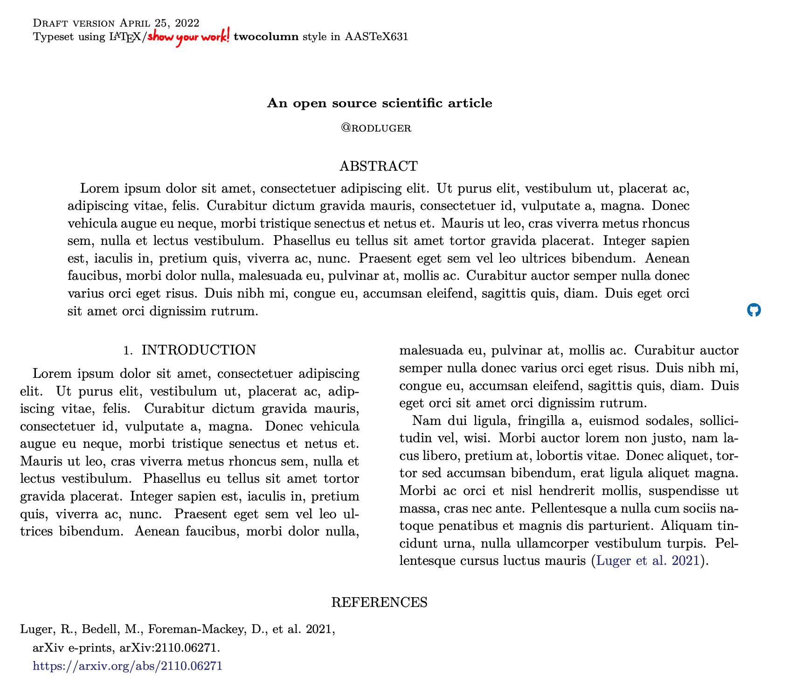
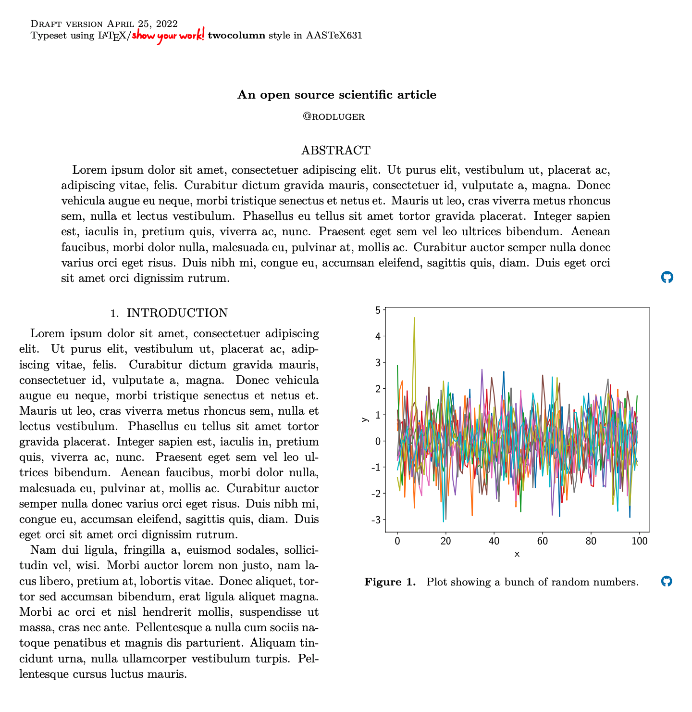
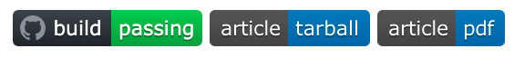

Quickstart
==========

Install
-------

To get started with |showyourwork|, install it using the ``pip`` command:

.. code-block:: bash

    pip install showyourwork

You'll also need to have the ``conda`` package manager installed, which you
can download from `this url <https://www.anaconda.com/products/distribution>`_.

Setup
-----

To set up a blank article, simply execute the ``showyourwork setup`` command. This
command accepts one positional argument: the "slug" of the GitHub repository
for the article, which is a string in the form ``user/repo``. For example,
to create a repository called ``article`` under the GitHub user ``rodluger``,
run

.. code-block:: bash

    showyourwork setup rodluger/article

This will bring up the following prompt:

.. raw:: html

    <pre>
    Let's get you set up with a new repository. I'm going to create a folder called

        article

    in the current working directory. If you haven't done this yet, please visit

        <a href="https://github.com/new">https://github.com/new</a>

    at this time and create an empty repository called

        rodluger/article
    </pre>

As requested, if you haven't yet created the remote repository, go to
`github.com/new <https://github.com/new>`_ in your browser to create an empty repository of
the same name. There's no need to create a README, gitignore file, or LICENSE
at this time, as |showyourwork| will set those up for you.

Press any key to bring up the next prompt:

.. raw:: html

    <pre>
    You didn't provide a caching service (via the --cache
    command-line option), so I'm not going to set up remote caching for this repository.
    </pre>

The |showyourwork| workflow automatically caches the results of intermediate
steps in your pipeline on Zenodo, but only if the user requests it via the ``--cache``
option. Let's not worry about this for
now -- you can read up on how this all works at :doc:`zenodo`.

Press any key to bring up the final prompt:

.. raw:: html

    <pre>
    You didn't provide an Overleaf project id (via the --overleaf command-line
    option), so I'm not going to set up Overleaf integration for this repository.
    </pre>

The workflow can also manage integration with an Overleaf project if that's how
you prefer to write your TeX articles. To enable this, re-run ``showyourwork setup``
with ``--overleaf=XXX``, where ``XXX`` is the 24-character project id of a
blank Overleaf repository (you can grab this value from the URL of the project
after creating it on Overleaf). Let's again skip this for now -- read all about it
at :doc:`overleaf`.

Finally, press any key to generate the repository. This will create a new folder
in the current working directory with the same name as your repo (``article``, in
the example above) and set up ``git`` tracking for it.

Build locally
-------------

Your new repository is instantiated from a bare-bones template with the minimal
|showyourwork| layout, which you can read about at :doc:`layout`.
The first thing you might want to do is edit the main TeX file, which is located
at ``src/tex/ms.tex``. Give it a custom title, edit the author name, and replace
some of the Lorem Ipsum placeholder text with something informative. Then,
compile the article PDF by running

.. code-block:: bash

    showyourwork build

or, as a shorthand, just

.. code-block:: bash

    showyourwork

in the top level of your repository. The first time you run this, |showyourwork|
will set up a new ``conda`` environment and install a bunch of packages, so it
could take one or two minutes. The workflow will then build your article PDF, 
which by default is saved as ``ms.pdf`` in the top level of your repository:

There's not much to see -- mostly placeholder text. One thing to note, though,
is the blue GitHub icon in the right margin next to the abstract: this is a
hyperlink pointing to your github repository (or, in this example, to
``github.com/rodluger/article``.)

Let's turn this into a proper scientific article by adding a figure. In
|showyourwork|, all figures should be programmatically generated, so we start
by creating a script to generate the figure. For simplicity, let's create a
script ``random_numbers.py`` to generate and plot some random numbers:

.. code-block:: python

    import matplotlib.pyplot as plt
    import numpy as np
    import paths

    # Generate some data
    random_numbers = np.random.randn(100, 10)

    # Plot and save
    fig = plt.figure(figsize=(7, 6))
    plt.plot(random_numbers)
    plt.xlabel("x")
    plt.ylabel("y")
    fig.savefig(paths.figures / "random_numbers.pdf", bbox_inches="tight", dpi=300)

By default, the |showyourwork| workflow expects figure scripts to be located in
(or nested under) ``src/scripts``, so that's where we'll put this script. 

.. important::

    The default location for figure *output* (i.e., the generated ``.pdf`` figure files)
    is in the ``src/tex/figures`` directory, so we need to make sure figure scripts
    save their output into that folder, *regardless of where the script is executed
    from*. The simplest way to do this is to import the
    ``paths`` module, a file that is automatically included in the ``src/scripts``
    directory when you create a new article repository with |showyourwork|. This
    module defines a few convenient paths, like ``figures`` and ``data``. These are instances of
    ``pathlib.Path`` objects pointing to the absolute paths of various useful workflow
    directories.

Now that we've created our figure script, let's include the figure in our
article by adding the following snippet in the body of ``src/tex/ms.tex``:

.. code-block:: TeX

    \begin{figure}[ht!]
        \script{random_numbers.py}
        \begin{centering}
            \includegraphics[width=\linewidth]{figures/random_numbers.pdf}
            \caption{
                Plot showing a bunch of random numbers.
            }
            \label{fig:random_numbers}
        \end{centering}
    \end{figure}

Here we're using the standard ``figure`` environment and ``\includegraphics``
command to include a PDF in our article. The one important bit of syntax that
is specific to |showyourwork| is the ``\script`` command, which is how we
tell |showyourwork| that the figure ``src/tex/figures/random_numbers.pdf``
can be generated by running the script ``src/scripts/random_numbers.py``.
Note that within the ``\script`` command, all paths are relative to 
``src/scripts`` (where the workflow expects these scripts to be located);
within calls to ``\includegraphics`` and other similar commands, paths
are relative to the ``graphicspath``, which by default is ``src/tex/figures``.

.. important::

    Previous versions of |showyourwork| inferred the name of the figure 
    script directly from the figure ``\label`` command. 
    This functionality is now deprecated; users must now either use the ``\script``
    command or define a custom Snakemake rule to generate a figure from
    a script.

If we now run |showyourwork| again, we'll get a message saying ``conda`` needs
to download and install some more packages. Once that's done, a message will
inform us the figure ``random_numbers.pdf`` is being built, and if that goes
well, we'll get a recompiled article PDF that looks like this:

In addition to automatically building our figure for us, |showyourwork| has
also included a GitHub icon in the margin next to its caption, which points to
the script that generated it (in this case, ``random_numbers.py``). Importantly,
the link points to the exact *version* of the script (i.e., to the specific
commit SHA on GitHub) that was used to generate the figure.

If you haven't yet pushed your changes to GitHub, that URL won't exist yet;
so let's sync our changes with the remote next.

Build on the remote
-------------------

Whenever you make a change to your article (add text, add a figure, edit
a script), make sure to ``git add`` any new/modified files,
commit your changes, and then push to the GitHub remote:

.. code-block:: bash

    git add src/scripts/random_numbers.py
    git add src/tex/ms.tex
    git commit -m "added a new figure"
    git push -u origin main

.. note:: 

    Note that we're only adding the figure *script*, not the figure file, to
    the list of files tracked by ``git``. In fact, if you try to add the figure
    file, you'll get an error:

    .. code-block:: bash

        git add src/tex/figures/random_numbers.pdf

        The following paths are ignored by one of your .gitignore files:
        src/tex/figures/random_numbers.pdf
        Use -f if you really want to add them.

As soon as you push your changes to GitHub, a GitHub Action will be triggered
on your repository, which will build your article from scratch on the cloud.
To track the build, click on the |actions| tab of your repository. The first
time your article is built, the action will have to download and install
``conda``, so it will likely take a few minutes. Subsequent builds take
advantage of intelligent cross-build caching, so they will likely run
faster.

When the build is done, you can click on any of the badges on the front
page of your repository:

.. raw:: html

     

these will take you to the build logs, the article tarball (containing the
TeX files and all generated figures), and the compiled PDF of the article,
respectively.

That's it for this quickstart tutorial. Please check out the rest of the 
documentation for more information on how to customize your workflow, 
debug issues, etc.